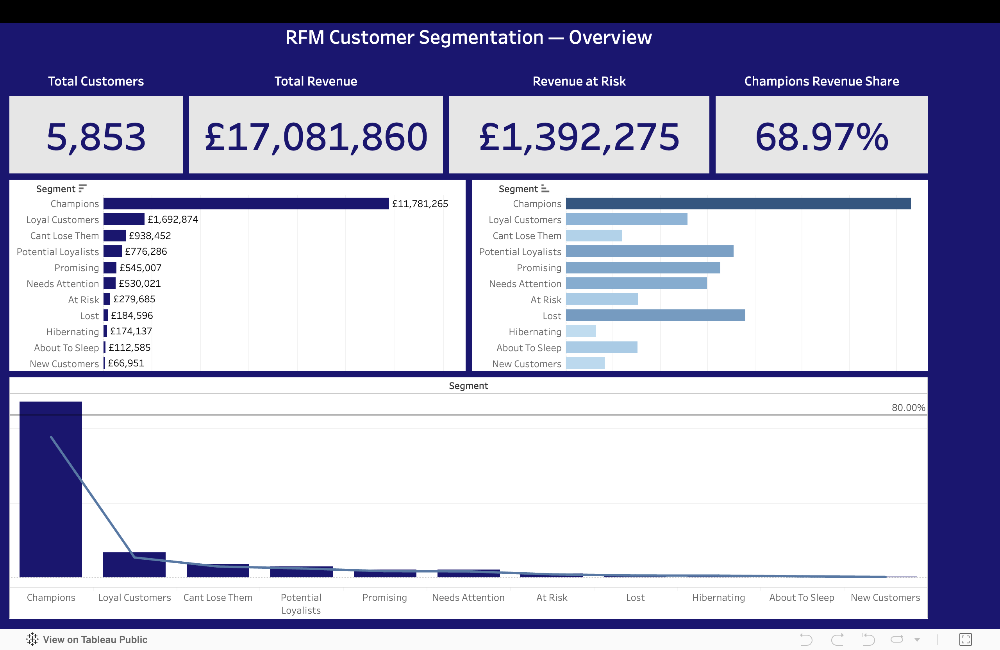
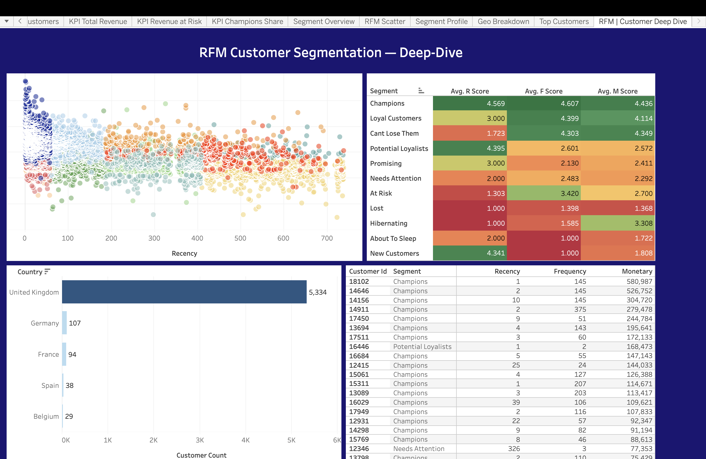

# RFM Customer Segmentation Analyzer

An end-to-end customer segmentation project that transforms 1M+ raw e-commerce transactions into 11 actionable customer segments using RFM (Recency, Frequency, Monetary) analysis — built across a four-stage pipeline: **Python → PostgreSQL → Excel → Tableau**, with AI-generated marketing recommendations per segment.

**Live Dashboards:** [View on Tableau Public](https://public.tableau.com/app/profile/pratham.kumar5320/viz/RFM_Analyzer/SegmentOverview?publish=yes)

---

## The Business Problem

Not all customers are equal. A retailer's marketing budget is wasted if every customer gets the same message — VIPs need retention, dormant high-spenders need win-back offers, and one-time big spenders need a nudge toward a second purchase.

This project answers: **"Who are our customers, how much is each group worth, and what should we do about each one?"**

## Key Findings

| Finding | Number |
|---|---|
| Champions (25% of customers) drive nearly 69% of all revenue | £11.78M of £17.08M |
| Revenue currently at risk (dormant high-value segments) | **£1,392,275** |
| Top 3 segments account for ~84% of total revenue (Pareto) | Champions + Loyal + Cant Lose Them |
| Highest-value single customer | £580,987 (145 orders) |
| Largest upsell opportunity: a customer with only 2 orders | £168,473 spent |

The single most actionable insight: **£1.39M sits in three segments (At Risk, Cant Lose Them, Hibernating) that a targeted win-back campaign could recover** — prioritized by dormancy length, not just historical spend.

---

## Dataset

**Online Retail II** — [UCI Machine Learning Repository](https://archive.ics.uci.edu/dataset/502/online+retail+ii)

| Metric | Value |
|---|---|
| Period covered | 01 Dec 2009 – 09 Dec 2011 |
| Raw transaction rows | 1,067,371 |
| Cleaned transaction rows | 776,830 (72.8% retained) |
| Unique customers | 5,853 |
| Total revenue | £17,081,859.77 |

> **Note:** The full cleaned dataset (`online_retail_clean.csv`, ~71 MB) and the customer-level `RFM_Scored.csv` export are not included in this repo due to size. Both can be regenerated by running the notebook (`python/RFM_Analyzer.ipynb`) against the raw UCI file. All aggregated query outputs used by the Excel workbook and Tableau dashboards are included in `sql/outputs/` and `data/`.

---

## Pipeline

```
┌─────────────┐    ┌──────────────┐    ┌─────────────┐    ┌──────────────┐
│   PYTHON     │ →  │  POSTGRESQL   │ →  │    EXCEL     │ →  │   TABLEAU     │
│ EDA + clean  │    │ RFM scoring + │    │ 11-sheet     │    │ 7 worksheets  │
│ 1.07M → 777K │    │ 11 segments   │    │ workbook     │    │ 2 dashboards  │
└─────────────┘    └──────────────┘    └─────────────┘    └──────────────┘
                          │
                          ▼
                   ┌──────────────┐
                   │  GEMINI API   │
                   │ AI insight per│
                   │ segment       │
                   └──────────────┘
```

### Phase 1 — Python (EDA & Cleaning) · `python/RFM_Analyzer.ipynb`

- Loaded and merged both sheets of the Online Retail II dataset (1,067,371 rows)
- Removed cancelled invoices, missing customer IDs, non-product stock codes, and invalid quantities/prices
- Engineered a `Revenue` column and validated cleaning at every step
- Result: **776,830 clean transactions across 5,853 customers**, loaded into PostgreSQL

### Phase 2 — PostgreSQL (RFM Scoring & Segmentation) · `sql/RFM_analyzer.sql`

- Computed per-customer **Recency** (days since last purchase), **Frequency** (order count), and **Monetary** (total spend)
- Scored each dimension 1–5 using `NTILE(5)` window functions
- Mapped R/F/M score combinations into **11 named segments** (Champions, Loyal Customers, Cant Lose Them, Potential Loyalists, Promising, Needs Attention, At Risk, Lost, Hibernating, About To Sleep, New Customers)
- 12 analytical queries (`q01`–`q11` + validation) covering segment sizing, revenue contribution, at-risk revenue, actionable customer lists, geographic composition, and an R×F score grid — all outputs in `sql/outputs/`

### Phase 3 — Excel (Analytical Workbook) · `excel/RFM_Segmentation.xlsx`

An 11-sheet workbook where **every summary number is a live formula** (`COUNTIF` / `AVERAGEIF` / `SUMIF` / `INDEX-MATCH`) computed from the raw customer-level table — updating the source recalculates the entire workbook:

- **Dashboard** — 5 formula-driven KPI cards + revenue-by-segment chart
- **Segment_Summary / Segment_Value** — segment sizing, revenue share, cumulative Pareto %, and at-risk flagging
- **Geo_Analysis** — segment composition across top-5 countries
- **KPI_Summary** — segment profiles joined with AI-generated insights
- **VIP_Champions / WinBack_CantLoseThem / Upsell_Targets** — actionable top-20 customer lists, including a formula-driven win-back priority tier (High / Medium / Low by dormancy)

### Phase 4 — Tableau Public (Interactive Dashboards) · `tableau/`

**Dashboard 1 — Segment Overview** *(executive view)*
KPI banner (customers, revenue, revenue-at-risk, Champions share) · revenue & size by segment · Pareto revenue-concentration curve with 80% reference line

**Dashboard 2 — Customer Deep-Dive** *(analytical view)*
5,853-point customer scatter (Recency × Monetary, log scale, colored by segment) · segment RFM-profile heatmap · geographic breakdown · sortable top-20 customer table — all cross-filtered by segment





### AI-Generated Segment Insights · `python/ai_segment_insights.py`

Each segment's RFM profile is sent to **Google's Gemini API** (`gemini-2.5-flash-lite`), which returns a plain-English behavior description and a specific marketing recommendation. The script checkpoints after every segment, so quota interruptions resume where they left off. Outputs feed the Excel KPI_Summary sheet (`data/segment_ai_insights.csv`).

---

## The 11 Segments

| Segment | Customers | Avg Recency | Avg Frequency | Avg Monetary | Revenue Share |
|---|---|---|---|---|---|
| Champions | 1,462 | 20 days | 15.6 | £8,058 | **68.97%** |
| Loyal Customers | 516 | 103 days | 8.5 | £3,281 | 9.91% |
| Cant Lose Them | 238 | 345 days | 8.9 | £3,943 | 5.49% |
| Potential Loyalists | 711 | 26 days | 2.6 | £1,092 | 4.54% |
| Promising | 655 | 110 days | 2.1 | £832 | 3.19% |
| Needs Attention | 600 | 310 days | 2.3 | £883 | 3.10% |
| At Risk | 307 | 446 days | 3.8 | £911 | 1.64% |
| Lost | 761 | 560 days | 1.1 | £243 | 1.08% |
| Hibernating | 130 | 521 days | 1.6 | £1,340 | 1.02% |
| About To Sleep | 306 | 319 days | 1.0 | £368 | 0.66% |
| New Customers | 167 | 30 days | 1.0 | £401 | 0.39% |

---

## Repository Structure

```
RFM-Customer-Segmentation/
├── data/
│   ├── segment_ai_insights.csv      # AI-generated descriptions + recommendations
│   └── segment_summary.csv          # 11-segment rollup (Q12 export)
├── excel/
│   └── RFM_Segmentation.xlsx        # 11-sheet formula-driven workbook
├── python/
│   ├── RFM_Analyzer.ipynb           # Phase 1: EDA, cleaning, DB load
│   └── ai_segment_insights.py       # Gemini API segment insights (checkpointed)
├── sql/
│   ├── RFM_analyzer.sql             # Phase 2: RFM scoring + 12 queries
│   └── outputs/                     # q01–q11 + validation query exports
├── tableau/
│   ├── RFM_Analyzer.twb             # Tableau workbook (7 sheets, 2 dashboards)
│   └── dashboards/                  # Dashboard screenshots
├── .gitignore
└── README.md
```

---

## How to Reproduce

1. **Get the data:** download Online Retail II from the [UCI repository](https://archive.ics.uci.edu/dataset/502/online+retail+ii)
2. **Phase 1:** run `python/RFM_Analyzer.ipynb` — cleans the data and loads it into a local PostgreSQL database (connection settings via `.env`)
3. **Phase 2:** run `sql/RFM_analyzer.sql` in PostgreSQL — builds the scored RFM view and exports the 12 query outputs
4. **AI insights (optional):** add a free [Google AI Studio](https://aistudio.google.com) key to `.env` as `GEMINI_API_KEY`, then run `python/ai_segment_insights.py`
5. **Phase 3/4:** open `excel/RFM_Segmentation.xlsx` and `tableau/RFM_Analyzer.twb` — both connect to the exported CSVs

**Requirements:** Python 3.12+ (`pandas`, `sqlalchemy`, `psycopg2`, `google-genai`, `python-dotenv`), PostgreSQL 15+, Excel, Tableau Public

---

## Tech Stack

`Python` · `pandas` · `PostgreSQL` · `SQL window functions` · `Excel (formulas, conditional formatting, charts)` · `Tableau Public` · `Google Gemini API`

---

## Author

**Pratham Kumar**
- GitHub: [@prathamkumarr](https://github.com/prathamkumarr)
- Tableau Public: [pratham.kumar5320](https://public.tableau.com/app/profile/pratham.kumar5320)
